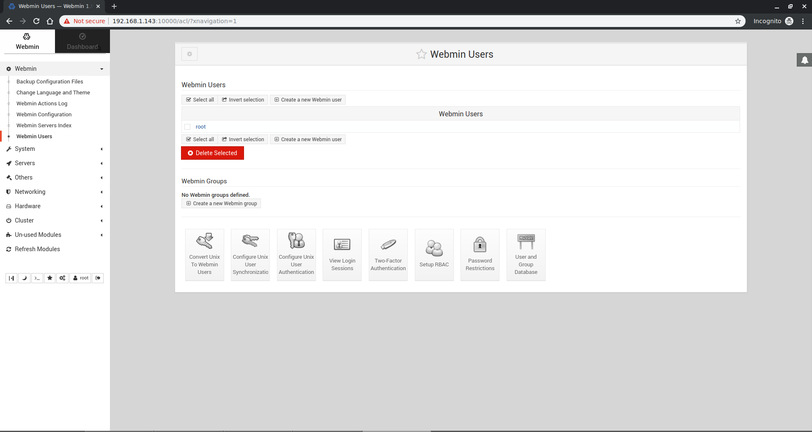
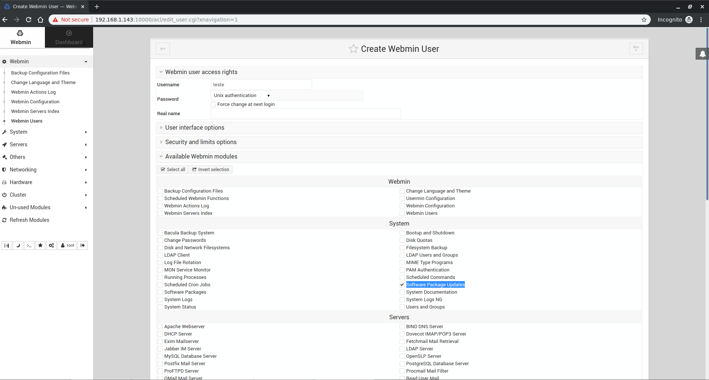
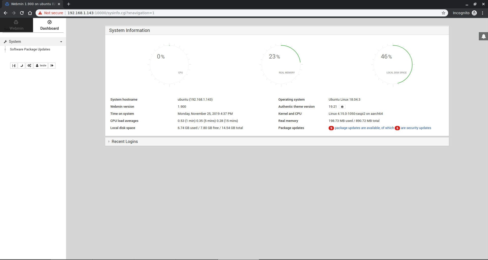
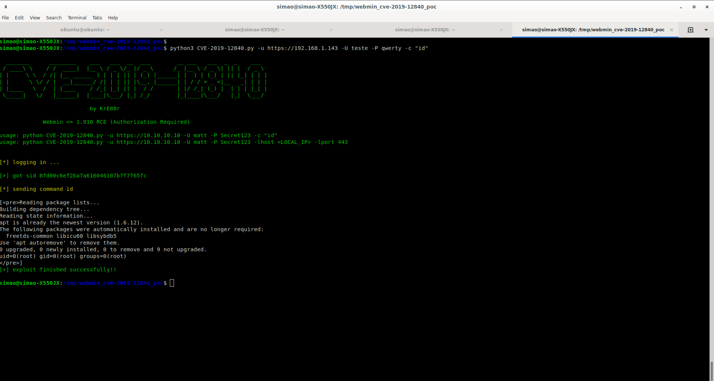

# CVE-2019-12840

## About
* <https://nvd.nist.gov/vuln/detail/CVE-2019-12840>


## PoC / Exploit
* <https://github.com/KrE80r/webmin_cve-2019-12840_poc>
 

## Environment used

* Ubuntu 18.04.3 LTS


## Reproduction 

* Run `bash script1.sh`
* Reboot
* Access <https://{IP}:10000/> with:
    <ul>
        <li>Username: <i>root</i></li>
        <li>Password: <i>admin</i></li>  
    </ul>

* Go to <i>Webmin -> Webmin users</i>
<p align="center">
  
</p>

* Create new Webmin user
<p align="center">
  
</p>

* To check if everything is good login as user <b>`teste`</b> and password <b>`qwerty`</b> and check result with image below:
<p align="center">
  
</p>


* Run
```bash
python3 CVE-2019-12840.py -u https://{IP} -U teste -P qwerty -c "id"
```
  The expect result should be similar to the following image: <br>
<p align="center">
  
</p>


