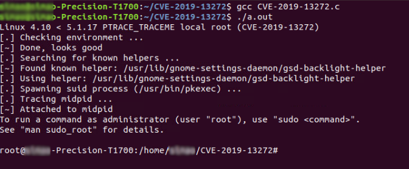

# CVE-2019-13272

## About
* <https://nvd.nist.gov/vuln/detail/CVE-2019-13272>


## PoC / Exploit
* <https://github.com/jas502n/CVE-2019-13272>
 

## Environment used

* Ubuntu 18.04.3 LTS

## Requirements
* OS with x86_64 architecture

## Reproduction 
* Terminal
```bash
bash script.sh
```
The expect result should be similar to the following image:

<p align="center">
  
</p>

