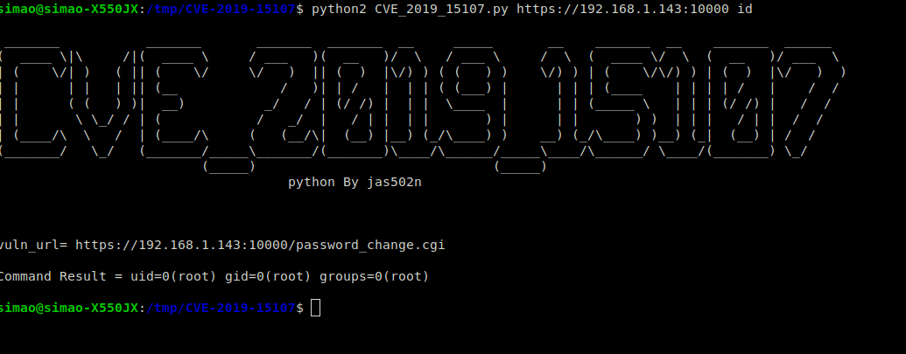

# CVE-2019-15107

## About
* <https://nvd.nist.gov/vuln/detail/CVE-2019-15107>


## PoC / Exploit

* <https://github.com/jas502n/CVE-2019-15107> 


## Environment used

* Ubuntu 18.04.3 LTS
* Webmin 1.90


## Reproduction
* Remote terminal
```bash
bash script.sh
```
* Terminal 2
```bash
python2 CVE_2019_15107.py https://{IP}:10000 {command} 
```
<br>
The result should be a message like the image below:
<p align="center">
  
</p>
