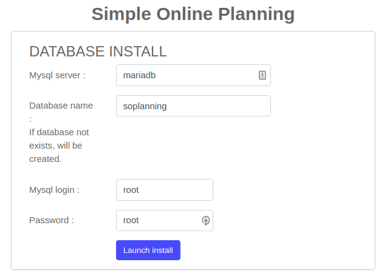
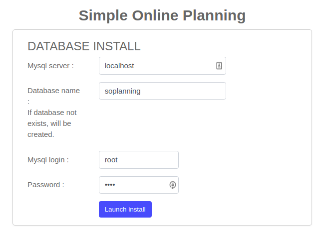

# CVE-2020-9268

## About
* <https://nvd.nist.gov/vuln/detail/CVE-2020-9268>

## PoC / Exploit
* <https://github.com/J3rryBl4nks/SOPlanning/blob/master/SQLInjectionProjects.md>


## Environment used
* Ubuntu 18.04.4 LTS
* SO Planning 1.45

## Reproduction
* Server
    - Docker:    
        ```shell script
        docker-compose up --build
        ``` 
      * Next open a browser and go to <http://YOUR-SERVER-IP:8080/soplanning> and fill the form as below:
      
      
    - Script:
        ```shell script
        sudo bash installation.sh
        ```        
    * Next open a browser and go to <http://YOUR-SERVER-IP/soplanning> and fill the form as below:
          

* Client
    ```shell script
    docker run --rm -it simaofsilva/cve-2020-9268-client
    ```


The result should be the content of the table *planning_user*.
